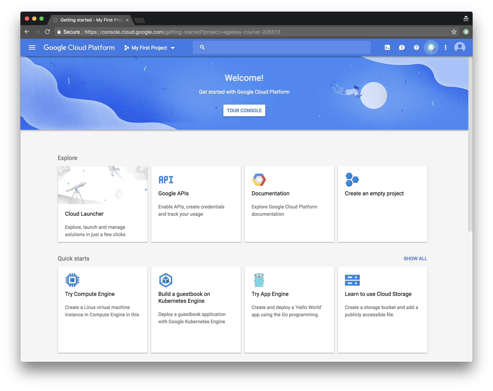
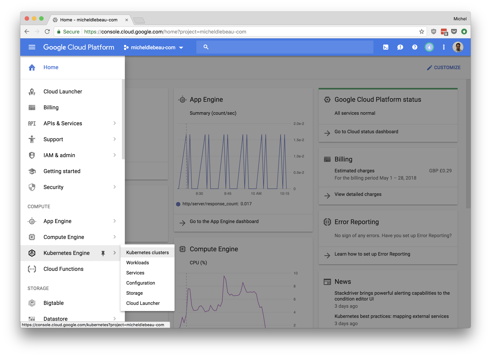

# DevOps Playground 21 - Google Kubernetes Engine


# Overview
In this meetup, we are going to create a Kubernetes cluster on Google Cloud, using preemptible instances. 
We will create an application, build a Docker image and push this image to the Google Container Registry
We will then run this image on the cluster, and then load test it.
We will decrease the performance of the application to see the cluster scale up, and then improve it to see the cluster scale back down. We will be doing changes to the application using rolling updates.


## A note on preemptible instances
Preemptible instances are instance that are up to 80% cheaper than normal ones on GCP, with the caveat that Google will request them back within 24h, when their platform require more compute. This is a great way to save money, as long as the application running on the infrastructure supports it.

# Hands On!

## Getting Started with GCP

### Logging on
https://console.cloud.google.com/

### Starting a free trial
Start the free trial


You will then need to fill your details.
Once everything is complete, you will be taken to this screen.



### Select your project

Select your project at the top, you will see a screen similar to this one.


## Google Kubernetes Engine
Navigate to Kubernetes engine, using the hamburger menu on the left hand side.


## Start the Google Cloud Shell
Google Cloud Shell is an interactive shell environment for Google Cloud Platform. It makes it easy for you to manage your projects and resources without having to install the Google Cloud SDK and other tools on your system. With Cloud Shell, the Cloud SDK gcloud command-line tool and other utilities you need are always available when you need them.

Cloud Shell provides the following:
* A temporary Compute Engine virtual machine instance
* Command-line access to the instance from a web browser
* Built-in code editor BETA
* 5 GB of persistent disk storage
* Pre-installed Google Cloud SDK and other tools
* Language support for Java, Go, Python, Node.js, PHP, Ruby and .NET
* Web preview functionality
* Built-in authorization for access to GCP Console projects and resources


## Create your GKE Cluster

### Command

```
gcloud config set container/use_v1_api false
export PROJECT_ID="$(gcloud config get-value project -q)"

gcloud beta container --project ${PROJECT_ID} clusters create "playground" --region "us-east1-b" --username "admin" --cluster-version "1.8.8-gke.0" --machine-type "f1-micro" --image-type "COS" --disk-size "10" --scopes "https://www.googleapis.com/auth/compute","https://www.googleapis.com/auth/devstorage.read_only","https://www.googleapis.com/auth/logging.write","https://www.googleapis.com/auth/monitoring","https://www.googleapis.com/auth/servicecontrol","https://www.googleapis.com/auth/service.management.readonly","https://www.googleapis.com/auth/trace.append" --preemptible --num-nodes "3" --network "default" --no-enable-cloud-logging --enable-cloud-monitoring --subnetwork "default" --enable-autoscaling --min-nodes "3" --max-nodes "7" --addons HorizontalPodAutoscaling,HttpLoadBalancing --enable-autorepair

gcloud container clusters get-credentials playground --zone us-east1-b --project ${PROJECT_ID}
```

This command will take roughly 5 minutes to complete.


### Details

* `gcloud beta container`: We use some beta features
* `--project ${PROJECT_ID}`: We specify which project to create the cluster into
* `clusters create "playground"`: We specify we want to create a new cluster called "playground"
* `--region "us-east1-b"`: Region in which the cluster will be created
* `--username "admin"`: Root username
* `--cluster-version "1.8.8-gke.0"`: Kubernetes version
* `--machine-type "f1-micro"`: Size of the underlying VM instances
* `--image-type "COS"`: Image running on the VM, Container-Optimized OS
* `--scopes ...`: Type and level of API access to grant the VMs
* `--preemptible`: User preemptible VMs, which Google can terminate if it requires more compute. [See more...](https://cloud.google.com/preemptible-vms/)
* `--num-nodes "3"`: Require 3 VMs for the cluster
* `--network "default" --subnetwork "default"`: Use the default network and subnetwork
* `--no-enable-cloud-logging --enable-cloud-monitoring`: Disable logging but enable monitoring to Stackdriver
* `--enable-autoscaling`: Enable the cluster to scale up and down based on resources required by the pods
* `--min-nodes "3" --max-nodes "7"`: The cluster can scale between 3 and 7 nodes
* `--addons HorizontalPodAutoscaling,HttpLoadBalancing`: Required to allow the cluster to scale the pods and use the Google Cloud Load Balance.
* `--enable-autorepair`: Let GKE repair unhealthy nodes

## Build your application image

### Open cloudshell editor


### Create the playground folder


### Create your application file
Your application is written in Golang, and will be written in the file `main.go`.
Create the main.go file first


Paste this as the content of the file:
```
package main
import (
        "fmt"
        "log"
        "net/http"
        "os"
        "time"
)

func main() {
        port := "8080"

        server := http.NewServeMux()
        server.HandleFunc("/", app)

        log.Printf("Server listening on the port %s", port)

        err := http.ListenAndServe(":"+port, server)
        log.Fatal(err)
}

func app(w http.ResponseWriter, r *http.Request) {
        log.Printf("Serving request: %s", r.URL.Path)
        host, _ := os.Hostname()

        fmt.Fprintf(w, "Hello, Edinburgh!\n")
        fmt.Fprintf(w, "Pod Name: %s\n", host)

        time.Sleep(time.Second)
}
```


### Create your Dockerfile

Create another file named `Dockerfile`, and paste the following as the content.
This file will be used to create an image of your app, which will then be run on the cluster.


```
FROM golang:1.8-alpine
ADD . /go/src/app
RUN go install app

FROM alpine:latest
COPY --from=0 /go/bin/app .
ENV PORT 8080
CMD ["./app"]
```


### Create your application image

We are now going to build the image.

`cd playground`
`docker build -t gcr.io/${PROJECT_ID}/app:v1 .`


### Testing the image locally
Try running your image locally, on port 8080.
`docker run  --rm -p 8080:8080  gcr.io/${PROJECT_ID}/app:v1`
Then preview the app on port 8080. The Cloud Shell has a handy shortcut for that.


Close the tab and run `ctrl+C` to stop the web preview

### Push the image to Google Container Registry
As your image works, it's time to push it to the Google Container Registry
`gcloud docker -- push gcr.io/${PROJECT_ID}/app:v1`


## Run the image in the cluster and expose the deployment
### Creating a deployment
Now that the image is on the registry, we can simply run it on our cluster
`kubectl run app --image=gcr.io/${PROJECT_ID}/app:v1 --port 8080 --requests="cpu=100m"`


### Expose the deployment
The application is running, however we cannot access it externally yet, we need to expose it.

Expose the app deployment through a load balancer on port 80.
`kubectl expose deployment app --type=LoadBalancer --port 80 --target-port 8080`
Go back to the GKE tab, and go on the Services page


After 50 seconds your public IP will be available if you press the refresh button, you can simply click on the link.


Or run `kubectl get svc app`, copy the External IP and access it in another tab.


Tada, your app is working!


## Enabling autoscaling for the app deployment
We will let GKE know that we want our pods to stay at around 80% load, so if the load goes over this threshold, it can create more pods, up to a maximum of 30, and if the load is under 80%, then it can delete some pods.

`kubectl autoscale deployment app --cpu-percent=80 --min=1 --max=30`

On the workloads page, look at the app deployment, and note the current load, and number of pods running the application at the moment.


## Load testing
### Create the load testing cluster
Now that the application is running, let's see how it reacts to load.
We will first create a separate cluster that will be responsible for handling the load testing.
We keep the clusters separate so that the load testing doesn't run out of resources.

```
gcloud beta container --project ${PROJECT_ID} clusters create "loadtesting" --zone "us-east1-b" --username "admin" --cluster-version "1.8.8-gke.0" --machine-type "custom-8-8192" --image-type "COS" --disk-size "10" --scopes "https://www.googleapis.com/auth/compute","https://www.googleapis.com/auth/devstorage.read_only","https://www.googleapis.com/auth/logging.write","https://www.googleapis.com/auth/monitoring","https://www.googleapis.com/auth/servicecontrol","https://www.googleapis.com/auth/service.management.readonly","https://www.googleapis.com/auth/trace.append" --preemptible --num-nodes "1" --network "default" --no-enable-cloud-logging --enable-cloud-monitoring --subnetwork "default" --addons HorizontalPodAutoscaling,HttpLoadBalancing --enable-autorepair
gcloud container clusters get-credentials loadtesting --zone us-east1-b --project ${PROJECT_ID}
```
This will take 5 minutes to complete.


### Create the load testing replication controllers and service

We will now create a file named `loadtest-deployment.yaml` that contains the three elements our load testing will need.
```
kind: ReplicationController
apiVersion: v1
metadata:
  name: locust-master
  labels:
    name: locust
    role: master
spec:
  replicas: 1
  selector:
    name: locust
    role: master
  template:
    metadata:
      labels:
        name: locust
        role: master
    spec:
      containers:
        - name: locust
          image: gcr.io/cloud-solutions-images/locust-tasks:latest
          env:
            - name: LOCUST_MODE
              value: master
            - name: TARGET_HOST
              value: http://app.ip.address
          ports:
            - name: loc-master-web
              containerPort: 8089
              protocol: TCP
            - name: loc-master-p1
              containerPort: 5557
              protocol: TCP
            - name: loc-master-p2
              containerPort: 5558
              protocol: TCP
---
kind: ReplicationController
apiVersion: v1
metadata:
  name: locust-worker
  labels:
    name: locust
    role: worker
spec:
  replicas: 30
  selector:
    name: locust
    role: worker
  template:
    metadata:
      labels:
        name: locust
        role: worker
    spec:
      containers:
        - name: locust
          image: gcr.io/cloud-solutions-images/locust-tasks:latest
          env:
            - name: LOCUST_MODE
              value: worker
            - name: LOCUST_MASTER
              value: locust-master
            - name: TARGET_HOST
              value: http://app.ip.address
---
kind: Service
apiVersion: v1
metadata:
  name: locust-master
  labels:
    name: locust
    role: master
spec:
  ports:
    - port: 8089
      targetPort: loc-master-web
      protocol: TCP
      name: loc-master-web
    - port: 5557
      targetPort: loc-master-p1
      protocol: TCP
      name: loc-master-p1
    - port: 5558
      targetPort: loc-master-p2
      protocol: TCP
      name: loc-master-p2
  selector:
    name: locust
    role: master
  type: LoadBalancer
```

**Replace `app.ip.address` with the IP address of your app deployment.**

Now go ahead and create these elements using the following command `kubectl create -f loadtest-deployment.yaml`.


Now back to the Services page, or run `kubectl get svc locust-master`, then go to the external IP on port 8089.

Welcome to Locust


Run a test with 10 users and a hatch rate of 10.


It doesn't seem to stress the app or cluster too much, so try again with 1000 users and 100 hatch rate.


The application is very simple, runs very fast and can be run concurrently easily, so we will need to slow it down a bit. (If you have the same issue in prod, don't follow the next steps, just open a beer and relax!)

## Slowing down our application
### Changing the code
In main.go, replace the end of the app function by the following. This will cause the pods to use 100% of its CPU for 2 seconds. 

```
  done := make(chan int) 
  for i := 0; i < 2; i++ { 
    go func() { 
      for { 
        select { 
          case <-done: return 
          default: 
        } 
      } 
    }()
  }
  time.Sleep(time.Second)
}
```

### Building the image
Build the new version of your image.
`docker build -t gcr.io/${PROJECT_ID}/app:v2 .`

### Push the new version to Google Container Registry
Push it to the Google Container Registry
`gcloud docker -- push gcr.io/${PROJECT_ID}/app:v2`

You can run the following command to get the exisisting pods and watch for changes, which will help show when pods and created or deleted: `kubectl get pods -w`

### Perform a rolling update
Now change which version of the image is used by your deployment. GKE allows you to update the version of the image used by your pods one at a time, or by group of X, with you setting what X should be.


## Perform another load test
Test again with 10 users

Keep the load running in the background.

## Scaling up
You can see the number of pods increasing after a couple of minutes


Wait a bit more and you will see the number of instances running as part of your cluster increase


Looking at Stackdriver gives another view into the load of the cluster.


Now, the application is actually behaving pretty badly, so let's improve its performance a little.

## Improving the app a little

Change the `i < 2;` in the snippet we added to `i < 1;`, this doubling the performance of the application.

Then build the new version of your image.
`docker build -t gcr.io/${PROJECT_ID}/app:v3 .`

Push it to the Google Container Registry
`gcloud docker -- push gcr.io/${PROJECT_ID}/app:v3`


Then do another rolling update, allowing 5 pods to be updated at a time


This works better now.
But let's get back to our original version, which worked much faster, thus should require less pods to answer the same number of requests.
Keep locust running to see how the load test is affected by the upgrade in real time.

## Scaling down
Do another rolling update, using the v1 of the application.

If you keep an eye on locust, you will see the RPS slow down, as pods are terminated, and then go up as they are replaced by pods running the more performant app.

If you keep it running for a while, you will see the deployment reduce the number of pods it uses, and the cluster reduce the amount of nodes it uses

## Cleanup
Delete the playground cluster
`gcloud beta container --project ${PROJECT_ID} clusters delete "playground" --region "us-east1-b" --async`

Delete the loadtesting cluster
`gcloud beta container --project ${PROJECT_ID} clusters delete loadtesting --zone us-east1-b --async`

Beware, there might still be some forwarding rules existing, which will cost you some money over time, so have a look and delete if anything still exists
Network Services > Load Balancing > advanced menu > Forwarding rules

